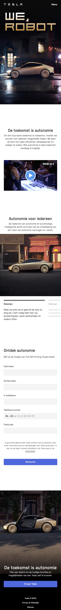

# Procesverslag
Markdown is een simpele manier om HTML te schrijven.  
Markdown cheat cheet: [Hulp bij het schrijven van Markdown](https://github.com/adam-p/markdown-here/wiki/Markdown-Cheatsheet).

Nb. De standaardstructuur en de spartaanse opmaak van de README.md zijn helemaal prima. Het gaat om de inhoud van je procesverslag. Besteedt de tijd voor pracht en praal aan je website.

Nb. Door *open* toe te voegen aan een *details* element kun je deze standaard open zetten. Fijn om dat steeds voor de relevante stuk(ken) te doen.

## Jij

  
uitwerken voor kick-off werkgroep

  ### Auteur:
  Jegor Mlokit

  #### Je startniveau:
  Blauw

  #### Je focus:
  Surface plane
 

## Je website

  
uitwerken voor kick-off werkgroep

  ### Je opdracht:
  https://www.tesla.com/nl_nl/we-robot

  #### Screenshot(s) van de eerste pagina (small screen): 
  WWW.Tesla.nl/We-Robot
  

  #### Screenshot(s) van de tweede pagina (small screen):
  WWW.Tesla.nl/Megapack
  
 

## Toegankelijkheidstest 1/2 (week 1)

  
uitwerken na test in 2e werkgroep

  ### Bevindingen
  Lijst met je bevindingen die in de test naar voren kwamen: Het eerste wat mij opviel toen ik de links afging is dat er al stond of ik ze al bezocht had of niet, dat was erg fijn. Ook was het fijn dat het aangaf of ik in de main was of in de footer, alleen was de main heel klein en stond er alleen dat er 'items' in de main stonden en niet wat de items waren, dat vond ik niet erg goed. Wel gaf het mooi aan als je bij een heading was aangekomen en dan ging het ook voorlezen wat er in de heading stond. 
  En wat mij het meest opviel is dat er een link was met 'skip to main content' dat was er fijn, want dan hoef je niet alles aanhoren en meteen zoeken wat je nodig hebt.

## Breakdownschets (week 1)

  

uitwerken na afloop 3e werkgroep

  ### de hele pagina: 
  
  
  

  ### dynamisch deel (bijv menu): 
  

## Voortgang 1 (week 2)

  
uitwerken voor 1e voortgang

  ### Stand van zaken
Ik was niet aanwezig bij het eerste voortgangsgesprek. Dus ik had ook geen feedback gekregen.

  ### Agenda voor meeting
  samen met je groepje opstellen

  | student 1      | student 2          | student 3    | student 4        |
  | ---            | ---                | ---          | ---              |
  | dit bespreken  | en dit             | en ik dit    | en dan ik dat    |
  | en dat ook nog | dit als er tijd is | nog een punt | dit wil ik zeker |
  | ...            | ...                | ...          | ...              |

  ### Verslag van meeting
  hier na afloop snel de uitkomsten van de meeting vastleggen

  - punt 1
  - punt 2
  - nog een punt
  - ...

## Voortgang 2 (week 3)

  
uitwerken voor 2e voortgang

  ### Stand van zaken
  Ik had niet zo veel. maar ik hoopte dat ik nog wel wat feedback zou kunnen ontvangen. en dat de vragen die ik had beantwoord kunnen worden.

  ### Agenda voor meeting
  samen met je groepje opstellen

  | student 1      | student 2          | student 3    | student 4        |
  | ---            | ---                | ---          | ---              |
  | dit bespreken  | en dit             | en ik dit    | en dan ik dat    |
  | en dat ook nog | dit als er tijd is | nog een punt | dit wil ik zeker |
  | ...            | ...                | ...          | ...              |

  ### Verslag van meeting
  hier na afloop snel de uitkomsten van de meeting vastleggen

  - Ik moet een main toevoegen in mijn code, want die had ik nog niet.
  - Werken aan de readme, want hij was nog leeg.
  - Ik moet wel nog veel doen.
  - een carousel toevoegen.
  - een video plaatsen op me page.
  - Menu toevoegen met behulp van detail summary.
  - links stylen met # ipv classes

## Toegankelijkheidstest 2/2 (week 4)

  
uitwerken na test in 9e werkgroep

  ### Bevindingen
  Lijst met je bevindingen die in de test naar voren kwamen (geef ook aan wat er verbeterd is):

## Voortgang 3 (week 4)

  
uitwerken voor 3e voortgang

  ### Stand van zaken
  Ik liep best ver achter met de opdracht, ik had ook een paar vragen waar ik graag antwoord op wilde dus ik had die voorbereid.

  ### Agenda voor meeting
  samen met je groepje opstellen

  | Jegor: Video embed
Twitter embedded
Anders korte versie

With van carousel 90%
Margin geven aan sections bottom

Kijken voor hover
Carousel hover

Text align start op form en de rest center.

Minder gebruik maken van classes
Footer css voor links

GitHub opruimen 
Map maken en daar alle images in doen

En maken tweede pagina 
       
  | Bas: AH logo was niet zichbaar op de website, ook vragen over de zoekbalk, omdat de zoekknop en het input field in elkaar zaten.              
  
  | Maya: Vragen hamburger menu 3 streepjes moet een kruisje worden. 
En hoe ze de tekst in de carousel plaatjes kan krijgen. Een golf bij haar footer moet bewegen       
  
  | Jasmine: Pijltjes bij de carousel, of dat erbij moet want op de echte site staan ze er wel. Het bol.com logo onderaan haar site werkt niet.        

        
         

  ### Verslag van meeting
  hier na afloop snel de uitkomsten van de meeting vastleggen

  - Ik moet nog heel veel doen.
  - 
  - 
  - 

## Eindgesprek (week 5)

  
uitwerken voor eindgesprek

  ### Je uitkomst - karakteristiek screenshots:
  

  ### Dit ging goed/Heb ik geleerd: 
  Korte omschrijving met plaatjes

  

  ### Dit was lastig/Is niet gelukt:
  Korte omschrijving met plaatjes

  

## Bronnenlijst

  
continu bijhouden terwijl je werkt

  Nb. Wees specifiek ('css-tricks' als bron is bijv. niet specifiek genoeg). 
  Nb. ChatGpT en andere AI horen er ook bij.
  Nb. Vermeld de bronnen ook in je code.

  1. https://developer.mozilla.org/en-US/docs/Web/HTML/Element/details
  2. https://codepen.io/ElenaDi07/pen/MeQmBZ
  3. "Geassisteerd door een interactieve AI-chat tijdens het ontwikkelen van een HTML-carousel en videoweergave, op 4 december."
     

